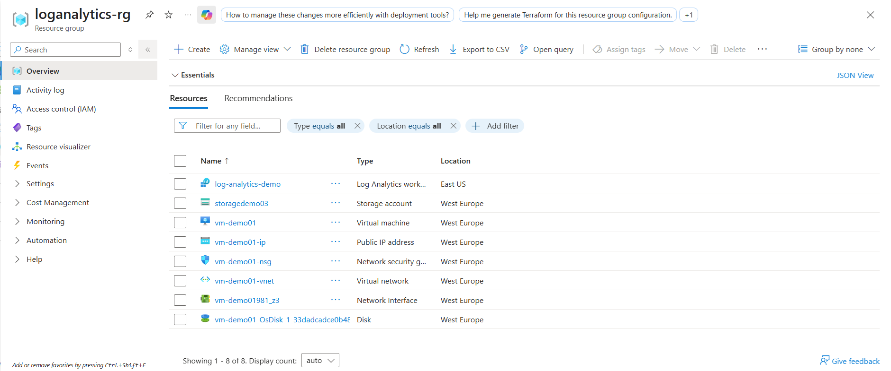
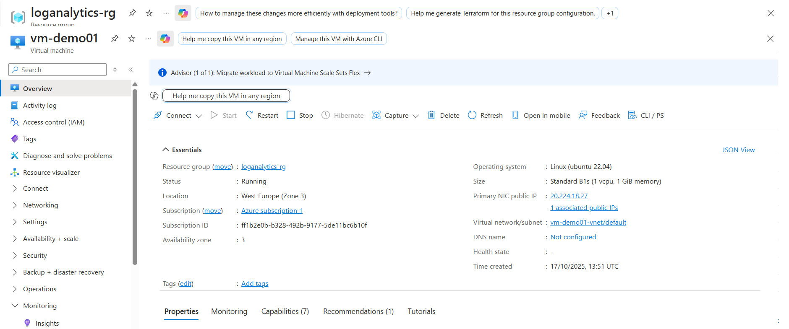
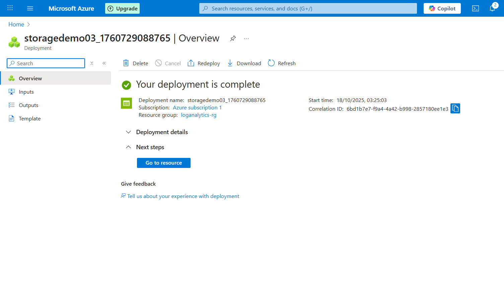

# azure-fundamanetals-labs
Beginner Azure mini-project demonstrating VM deployment, monitoring, and storage setup using Log Analytics.
# 🌐 Azure Fundamentals Mini Lab

## 🎯 Objective
A beginner-friendly Azure project demonstrating the creation, deployment, and monitoring of basic cloud resources.  
This project showcases core Azure concepts: **Resource Groups, Virtual Machines, Monitoring (Log Analytics), and Storage Accounts.**

---

## 🏗️ Resources Created
| Resource Type | Name | Purpose |
|----------------|------|----------|
| Resource Group | `loganalytics-rg` | Logical container for all resources |
| Virtual Machine | `vm-demo01` | Ubuntu 22.04 LTS VM for demonstration |
| Log Analytics Workspace | `log-analytics-demo` (auto-linked) | Collects VM metrics and logs |
| Storage Account | `storagedemo03` | Demonstrates Azure blob storage setup |

---

## ⚙️ Steps Performed

### 1️⃣ Create Resource Group
A resource group named **`loganalytics-rg`** was used (pre-created in the Azure sandbox).

📸 *Screenshot:* Resource Group overview  


---

### 2️⃣ Deploy Virtual Machine
An **Ubuntu Server 22.04 LTS** VM was created and deployed successfully.

- Size: Standard_B1s (or similar small VM)
- Region: East US / West Europe
- Authentication: Username & Password  
- Inbound ports: SSH (22)

📸 *Screenshot:* Deployment success page  


---

### 3️⃣ Enable Monitoring (VM Insights)
Enabled **Azure Monitor / VM Insights** and linked to the default Log Analytics Workspace.  
After ~15 minutes, CPU, memory, and disk metrics began populating.

📸 *Screenshot:* VM Insights graphs showing active data  


---

### 4️⃣ Create Storage Account
Created a **Standard LRS Azure Blob Storage** account to demonstrate storage setup.

- Kind: StorageV2 (general-purpose v2)  
- Performance: Standard  
- Redundancy: LRS (Locally Redundant Storage)  
- Access Tier: Hot  

📸 *Screenshot:* Storage Account Overview  


---

## 📊 Key Learnings
✅ Understood the structure of Azure Resource Groups  
✅ Learned how to deploy and monitor a virtual machine  
✅ Linked a VM to a Log Analytics Workspace for data collection  
✅ Created and configured an Azure Storage Account  

---

## 🧹 Clean-up
All resources were deleted after testing to avoid costs:
```bash
az group delete --name loganalytics-rg --yes --no-wait
🧠 Skills Demonstrated
Azure Portal navigation

Virtual Machine deployment

Log Analytics & Azure Monitor configuration

Basic cloud resource management and cost awareness

🖼️ Project Summary
This mini-lab demonstrates end-to-end deployment and monitoring of a cloud environment, ideal for AZ-900 or entry-level SOC/Cloud fundamentals portfolios.

📘 Author: Parthiban Ganesan
🎓 Platform: Microsoft Azure (Free Sandbox / Student Subscription)
🕒 Duration: ~1 hour
